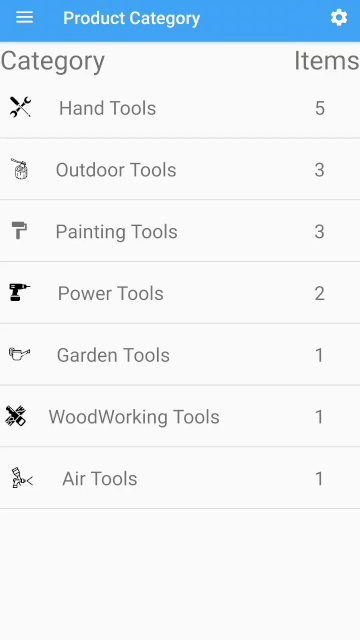
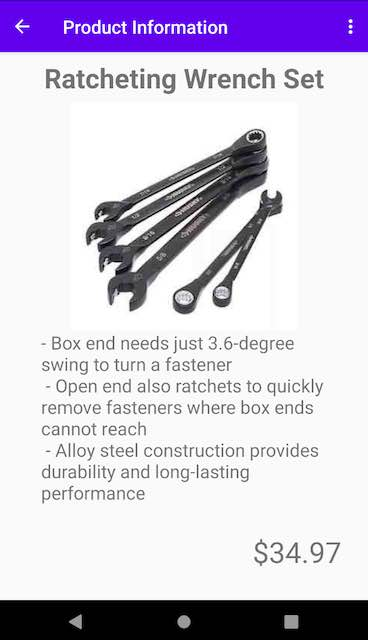
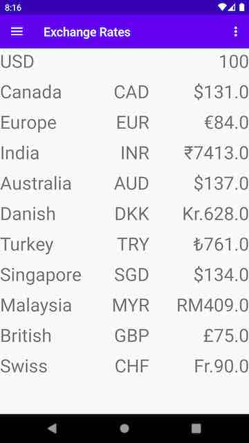
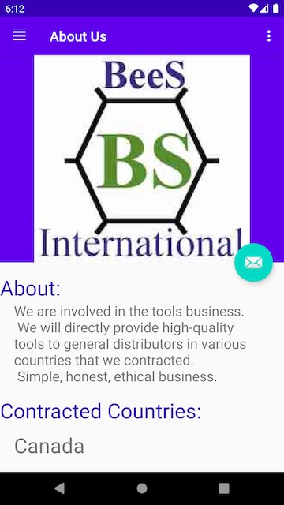

# BEES-International

## Author:
#### name: Ibrahim (Wusiman Yibulayin)
#### student ID: 0728356

## Table of contents
* [Description](#description)
* [Console Mode](#console-mode)
* [GUI Mode](#gui-mode)

## Description
This is an application for an international trade company. 
In this application, the customer will browse all products 
by category. When selecting a category, products related to that 
category will display in a ViewPager. In product viewPager, 
display product name, description and price. On the About Us page, 
display some information about our company. On the contact page, 
this app will use some intents to open Phone caller, Email and 
Map apps. This is just an information app; the customer cannot 
buy or order any product of this company. The only way to order is by 
connecting with email.

## Picture of Category Fragment

## Picture of Product ViewPager

## Picture of Exchange RecyclerViewPager

## Picture of About Us Fragment

## Picture of Contact Us Fragment

