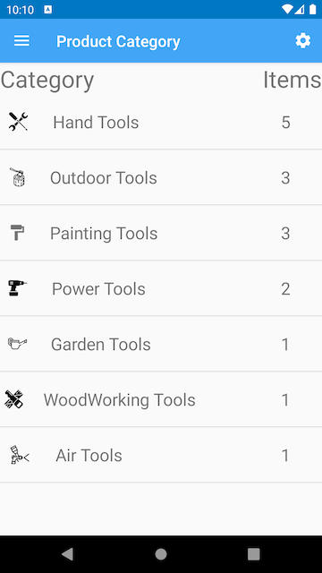
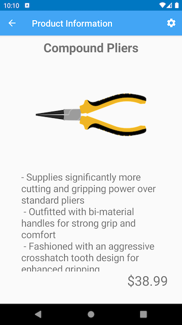
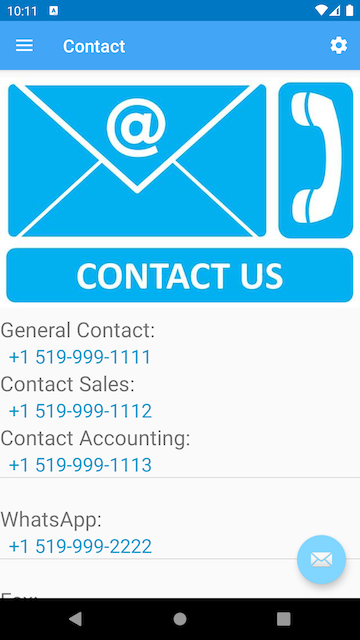
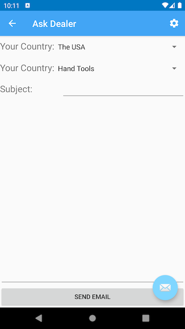
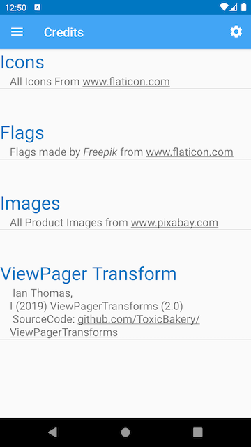

# BEES-International

## Contributor:
#### Name: Prof. Cai Filiault

## Author:
#### Name: Ibrahim (Wusiman Yibulayin)
#### Student ID: 0728356

## Table of contents
* [Description](#description)
* [Getting Started](#getting-started)
* [Prerequisites](#prerequisites)
* [Screen Shots](#screen-shots)
* [Acknowledgments](#acknowledgments)

## Description
This is an application for an international trade company. 
In this application, the customer will browse all products 
by category. When selecting a category, products related to that 
category will display in a ViewPager. In product viewPager, 
display product name, description and price. On the About Us page, 
display some information about our company. On the contact page, 
this app will use some intents to open Phone caller, Email and 
Map apps. This is just an information app; the customer cannot 
buy or order any product of this company. The only way to order is by 
connecting with email.

## Getting Started
BEES International is an Android app and it is very easy to use.
You can use this app to check the company's products to export,
and can check the exchange rates of your company. You can setup
the default currency to display the product price in your contry's
currency. Other important part of the application is to contact easily
to the company or to the dealer of your country. You can change
text display size in your confirtable size (Small, Medium or Large).

## Prerequisites
This application needs to install in an Android phone, and the Android version
is at least Android 4.4 (Kit Kat).

## Screen Shots

### Image of Menu Fragment

### Image of Category Fragment

### Image of Product ViewPager

### Image of Exchange RecyclerViewPager

### Image of About Us Fragment

### Image of Contact Us Fragment

### Image of Contact Us Tablet Fragment

### Image of Settings Fragment

### Image of Ask Dealer Fragment

### Image of Creadits Fragment

## Acknowledgments
I want to especially thank my teacher Prof. Cai Filiault.
He taught me how to use Android Studio to complete application
development. I learned a lot of design and programming
skills in this project.